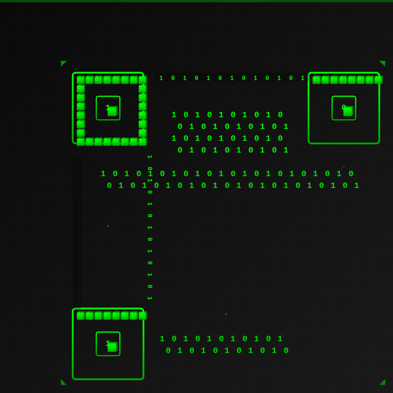

  

 

  

  <h2 style="color: #00FF00;"><em>"Code is like humor. When you have to explain it, it's bad."</em> – Cory House</h2>

## Programming Languages have been learned (not expert)

  

  
  
  
  
  
  
  
  
  
  
  
  
  
  
  
  

  

## Progress

 

  

 

  

 

  

  

## Contact

 

  
  
  

